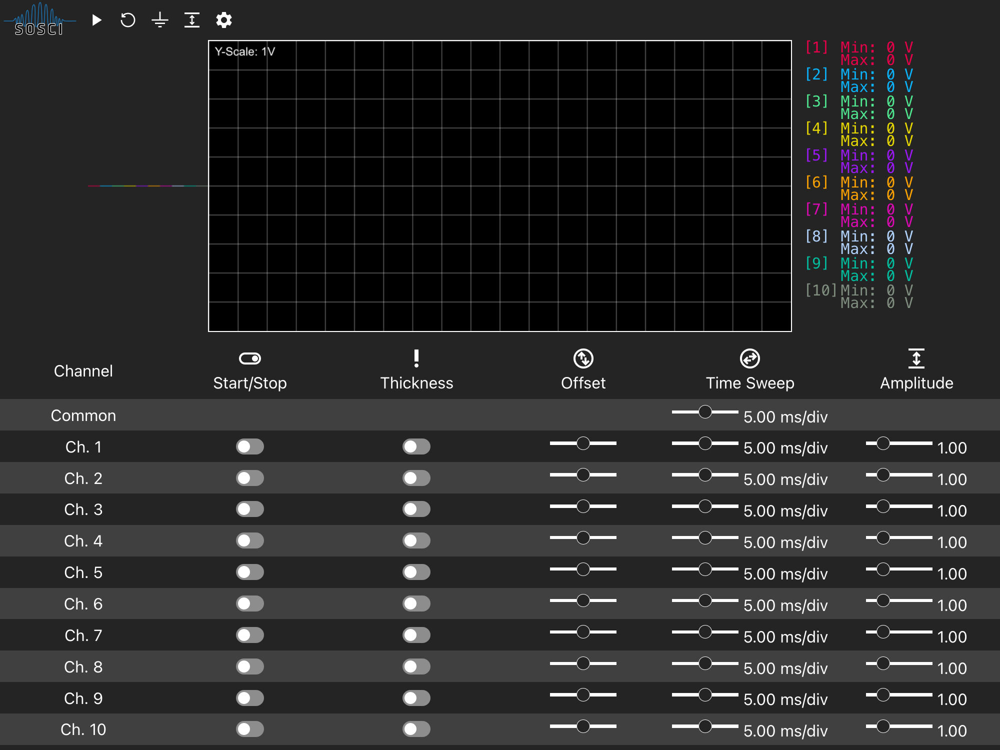
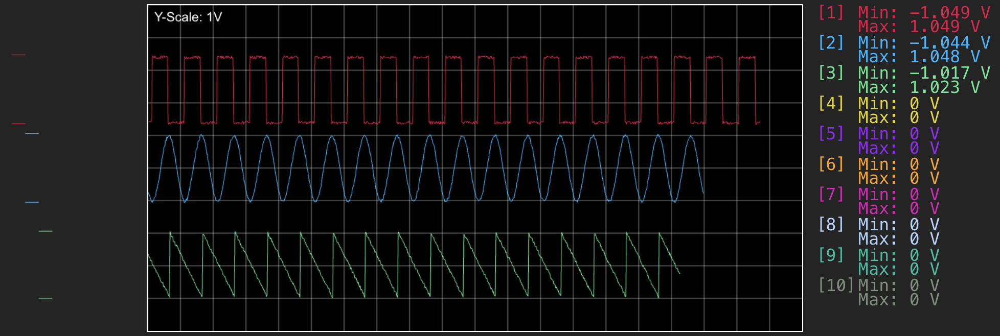
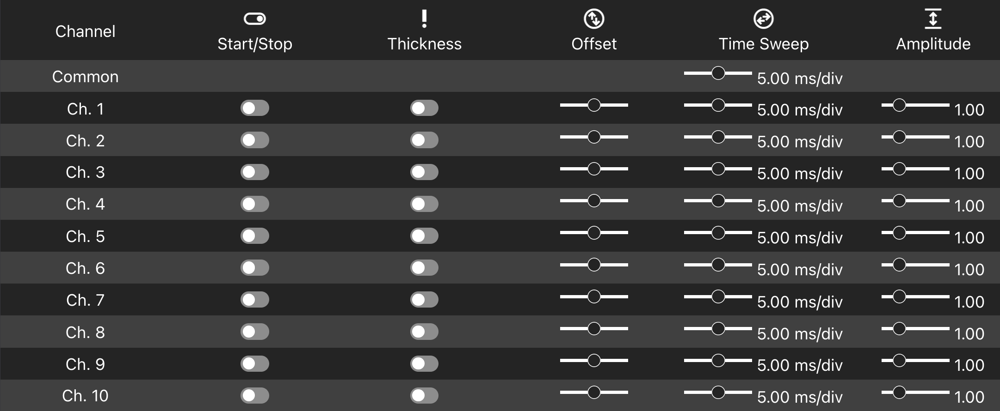
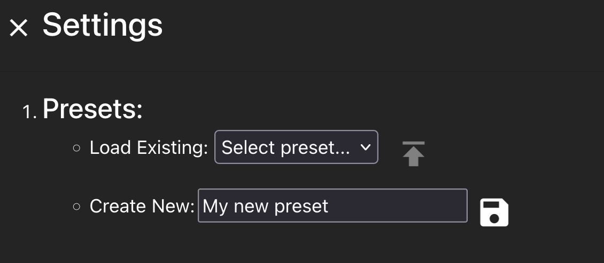

# SOSCI User Documentation

## Table of contents

- [Introduction](#1-introduction)
    - [Scope](#11-scope)
    - [Definitions, Abbreviations](#12-definitions-abbreviations)
    - [References](#13-references)
- [Getting started](#2-getting-started)
    - [How to access the frontend and backend?](#21-how-to-access-the-frontend-and-backend)
    - [How to send samples via UDP?](#22-how-to-send-samples-via-udp)
- [Using the frontend](#3-using-the-frontend)
    - [General](#31-general)
    - [Top control panel](#32-top-control-panel)
    - [Oscilloscope](#33-oscilloscope)
    - [Bottom control panel](#34-bottom-control-panel)
    - [Settings](#35-settings)
        - [Presets](#351-presets)

## 1. Introduction

SOSCI ("Software Oscilloscope") is an open source software oscilloscope that aims to simulate a 10-channel analog
oscilloscope.

Its main features are:

- Receiving samples over UDP
- Flexible and dynamic visualization of samples using channel-based configuration:
    - Toggle channels
    - Amplitudes
    - Offsets
    - Sweep speeds
- Presets for saving settings for later use
- A generator for simulating various types of waveforms
- A docker image for portability

### 1.1 Scope

This document contains information about the usage of the SOSCI application.
It contains an explanation about how to send samples to the application, as well as a list of all frontend components
and their usage.

It **does not** cover information about the architecture or building process of the Software.

### 1.2 Definitions, Abbreviations

| Abbreviation | Definition                                                                          |
|--------------|-------------------------------------------------------------------------------------|
| SOSCI        | Project name, Software Oscilloscope                                                 |
| Frontend     | The svelte frontend of SOSCI                                                        |
| Sample       | A number representing a voltage                                                     |
| Package      | A UDP package of 10 samples                                                         |
| Plot         | A continuous line that gets drawn from a stream of samples                          |
| Amplitude    | A number that scales the plot of a sample                                           |
| Offset       | A number that offsets the plot of a channel vertically                              |
| Time sweep   | A number that defines what time a plot needs to cross a certain horizontal division |

### 1.3 References

| Reference                                                                                                                       | Description                                                                              |
|---------------------------------------------------------------------------------------------------------------------------------|------------------------------------------------------------------------------------------|
| [Design / Architecture Documentation](https://github.com/amosproj/amos2022ws03-software-oscilloscope/wiki/Design-Documentation) | Contains information about design & architecture details about SOSCI and it's components |
| User Documentation   *This document*                                                                                        | Contains information about how to use SOSCI                                              |
| [Build Documentation](https://github.com/amosproj/amos2022ws03-software-oscilloscope/wiki/Build-&-Deployment-Documentation)     | Contains information about how to locally build SOSCI and the CICD environment           |

## 2. Getting started

Assuming the frontend, backend and optionally the generator have been built and are running according to the Build
documentation, here's how to get started using the oscilloscope.

### 2.1 How to access the frontend and backend?

The frontend is reachable under [http://localhost:5000](http://localhost:5000).

### 2.2 How to send samples via UDP?

The backend is reachable via UDP under [udp://localhost:34255](udp://localhost:34255).

When not using the generator, samples can be sent to the UDP endpoint ([udp://localhost:34255](udp://localhost:34255))
as packages of ten voltage values, as described in the design documentation.

## 3. Using the frontend

### 3.1 General

- Initially, the oscilloscope is turned off. You need to turn it on like described below.
- There are 10 channels with different colors.
- The frontend is only to be used in landscape (width > height).
- When using it on small screens, the bottom control panel is hidden and can be opened by tapping the caret at the
  bottom.
- There's a light and a dark mode, based on your OS color settings.

### 3.2 Top control panel

In the top left corner, you'll find a control panel for general control of the oscilloscope.

#### 3.2.1 Controls (from left to right)

- **Start/Stop:** Toggle processing all incoming samples.
- **Reset:** Reset the indicators and the oscilloscop to the initial state and stop processing incoming samples.
- **Ground:** While pressed, set all rendered lines to zero.
- **Distribute vertically:** Distribute all enabled lines vertically to take up the whole oscilloscope space.
- **Settings:** Open the settings modal for saving and loading presets.

### 3.3 Oscilloscope

#### 3.3.1 Components:

- **Line indicators:** Show the min and max values of all enabled channels with respect to their indidividual offsets
  and amplitudes.
- **Plot:** Renders the lines of enabled channels with respect to their individual offsets, amplitudes, sweep.
  speeds and thickness
- **Text indicators:** Show a textual min max value representation of all enabled channels.

### 3.4 Bottom control panel

The bottom control panel provides channel-based settings that influence the representation of incoming samples.

#### 3.4.1 Controls

- **Start/Stop:**
    - Toggle processing of a channel's samples.
    - Affects the plot and the indicators.
- **Thickness:**
    - Toggle thick rendering of a channel's plot line.
    - Affects the plot.
- **Offset:**
    - Set the vertical offset of a channel's plot line.
    - Values range from -1 to 1 and are related to the plot's vertical height. A value of 1 means that the zero line of
      a channel is located at the top end of the plot.
    - Affects the plot and the line indicators.
- **Time sweep:**
    - Set the speed in which a channel's line crosses one horizontal division of the plot.
    - Affects the plot.
- **Amplitude:**
    - Set the value that's been multiplied with a channel's plot line.
    - Values range from 0.2 to Infinity and represent the reciprocal value of the vertical scaling. A reciprocal value
      of 0.2 (0.2 = 1/5) means that the channel's values show as multiplied by 5.
    - Affects the plot and the line indicators.

### 3.5 Settings

#### 3.5.1 Presets

A preset consists of all settings for each channel. These are:

- Amplitudes
- Offsets
- Thickness
- On/Off
- Sweep Speed

The settings modal provides a form to save and load the current settings.

- **Creating a new preset:** Enter a name for the preset and click the save icon on the right.
- **Loading a preset:** Select your preset from the dropdown and click the load icon on the right.